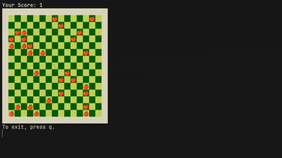

# 🐍 High-Performance Snake in Go

[](https://go.dev/)
[](LICENSE)
[](https://github.com/XPLassal/simple-snake-on-go/releases)

A modern, hyper-optimized implementation of the classic Snake game that runs directly in your terminal. Written in **Pure Go** with a focus on **Clean Architecture** and **O(1) Algorithms**.



---

## ⚡ Key Features (v3.0)

* **🚀 True O(1) Performance:** The game engine relies on a custom **Linked List via Map** data structure. Movement and collision checks are instant (~300ns), regardless of snake length.
* **🎮 Smart Input Handling:** Implemented **Input Locking** to prevent "suicide turns" (e.g., pressing Down -> Left too fast causing a self-collision). The game now intelligently processes the queue of direction changes.
* **🎨 Low-Allocation Rendering:** Uses a pre-allocated buffer and `bufio.Writer`. The entire frame (~23KB) generates only ~13 internal allocations, causing virtually zero GC pressure.
* **💻 Cross-Platform:** Runs natively on **Windows**, **Linux**, and **macOS** (Intel & Apple Silicon).
* **⚙️ Dynamic Gameplay:** "Hard Mode" increases game speed as you progress.

---

## 🎮 How to Play

### Option 1: Download Binary (Recommended)
You don't need Go installed. Just grab the executable for your OS from the [**Releases Page**](https://github.com/XPLassal/simple-snake-on-go/releases/latest).

| OS | File |
| :--- | :--- |
| 🪟 **Windows** | `snake-windows-amd64.exe` |
| 🐧 **Linux** | `snake-linux-amd64` |
| 🍎 **macOS (M1/M2)** | `snake-macos-arm64` |
| 🍎 **macOS (Intel)** | `snake-macos-intel` |

**Linux/macOS Note:**
If the file doesn't run, give it permission:
```bash
chmod +x snake-linux-amd64
./snake-linux-amd64
```

### Option 2: Build from Source

Requirements: [Go 1.23+](https://go.dev/dl/)

1.  **Clone the repository:**
    ```bash
    git clone [https://github.com/XPLassal/simple-snake-on-go.git](https://github.com/XPLassal/simple-snake-on-go.git)
    cd simple-snake-on-go
    ```
2.  **Run directly:**
    ```bash
    go run .
    ```
3.  **Build binaries:**
    ```bash
    ./build.sh
    ```

-----

## 📊 Performance Benchmarks

Benchmarks run on AMD Ryzen 5 5600H. The logic maintains **O(1)** complexity.

| Component | Operation | Time | Memory | Allocations |
| :--- | :--- | :--- | :--- | :--- |
| **Logic** | Move (Short) | \~360 ns/op | 0 B/op | **0 allocs/op** |
| **Logic** | Move (Medium) | \~230 ns/op | 0 B/op | **0 allocs/op** |
| **Logic** | Move (Huge) | \~280 ns/op | 0 B/op | **0 allocs/op** |
| **Render** | Draw Frame | \~22 µs/op | \~23 KB/op | **13 allocs/op** |

> **Proof:** Logic operations generate **zero garbage**. Rendering is heavily optimized to reuse memory buffers.

-----

## 🏗 Architecture

  * **Data Structures:** `map[Coordinates]Coordinates` acting as a Linked List.
      * **Key:** Current segment. **Value:** Next segment.
      * **Move:** Add Head, Delete Tail → **$O(1)$**
  * **Optimization:** Structures are passed by pointers (`*Snake`) to avoid memory copying.
  * **Rendering:** `strings.Builder` + `bufio.Writer` + ANSI Cursor Reset (`\033[H`).

-----

## 📄 License

This project is licensed under the MIT License - see the [LICENSE](https://www.google.com/search?q=LICENSE) file for details.
